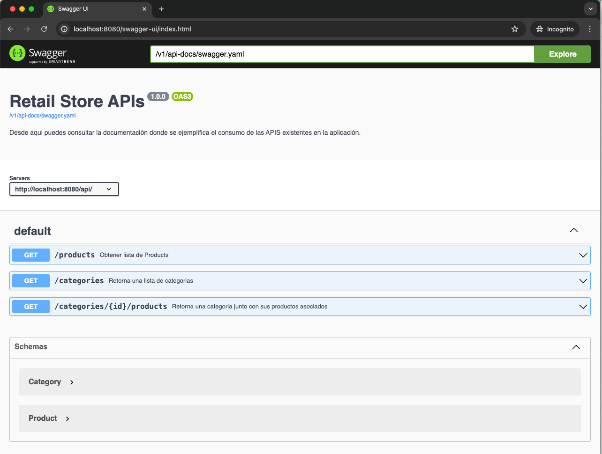

# Retail-store


## Descripción

Esta es una aplicación desarrollada con Spring Boot y Java. Proporciona un servicio RESTful para gestionar una tienda minorista y llevar acabo un inventario de productos.

## Dependencias del proyecto

- **Spring Security:** Seguridad en la aplicacion: proteje las rutas y los recursos del servidor de usuarios no autenticados o autorizados.
- **Spring Data:** Crea de forma automatica CRUD, Repositorios e Entidades: Para poder interactuar con las bases de datos de forma mas rapida
- **Spring Web:** Util para crear controladores y rutas para poder escuchar y responder peticiones de red
- **Lombok:** Genera constructores, metodos setters and getter, buildersy logs de forma rapida atraves de anotaciones en las clases.
- **H2:** Base de datos en memoria para hacer pruebas compatibles con JPA.
- **Spring devtools:** Util para agilizar el desarrollo mediante la recarga de cambios en el codigo fuente.
- **JUnit:** Para testing pruebas integracion y unitarias en los modulos de la aplicacion

## Requisitos

Antes de comenzar, asegúrate de tener los siguientes componentes instalados:

- [Amazon Corretto - Java Development Kit (JDK) 17 o superior](https://docs.aws.amazon.com/corretto/latest/corretto-17-ug/downloads-list.html)
- [Gradle 8.6 o superior](https://gradle.org/install/)

## Instalación

1. Clona el repositorio en tu máquina local

   **A traves de https:**

   ```sh
   git clone https://github.com/soydvaldez/retailer-store.git
   ```

   **A traves de ssh:**

   ```sh
   git clone git@github.com:soydvaldez/retailer-store.git
   ```

2. Navega al directorio del proyecto:
   ```sh retailer-store/
   cd retailer-store/
   ```

## Ejecución

3. Compila el proyecto utilizando Gradle: (Genera un archivo ejecutable .JAR)

   ```sh
   gradle wrapper && ./gradlew clean build
   ```

4. Levanta el proyecto utilizando el comando:
   ```sh
    ./gradlew bootRun
   ```
   Listo, siguiendo los pasos anteriores el servidor debe estar levantado y preparado para escuchar y responder peticiones en la red local.

## Consumo de las apis

El proyecto escucha peticiones por defecto por la red local: [http://localhost:8080/api/](http://localhost:8080/)

Existen dos rutas en la aplicacion: /api/products y /api/categories.

5. Consumir con el cliente http a traves de la terminal:
   Existen dos usuarios: **user** y **admin** los usuario, los cuales comparten la misma contraseña: **password**

   **Ejemplo de consumo con el usuario: user**

   Peticion hacia la ruta productos:

   ```sh
   http -a user:password "localhost:8080/api/products?page=2&size=4"
   ```

   **Ejemplo de consumo con el usuario: admin**

   Peticion hacia la ruta de categories:

   ```sh
   http -a admin:password "localhost:8080/api/products?page=2&size=4"
   ```

### Consumo de las apis desde Swagger

Para acceder a la documentacion de Swagger UI ingresa a link: [http://localhost:8080/swagger-ui/index.html](http://localhost:8080/swagger-ui/index.html)


Solicitara un usuario y contraseña, puedes utilizar dos:

   **Usuario con privilegios sobre swagger UI**
   Username: user
   Password: password

   **Usuario Administrador**
   Username: admin
   Password: password

Despues de ingresar las contraseñas debes de poder acceder a la documentacion:



6.- (Opcional) Para correr las pruebas del proyecto con Gradle, copia y pega en la terminal el siguiente comando:

```sh
 ./gradlew test
```